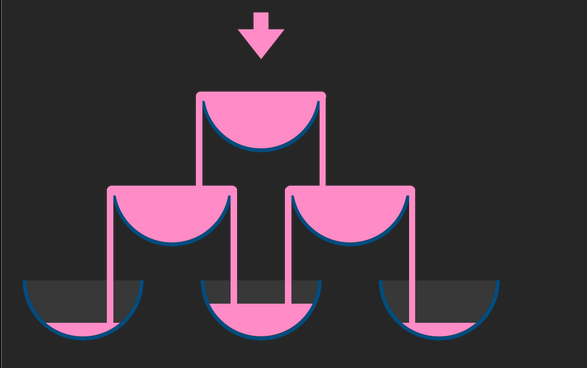

# Leetcode 799. Champagne Tower (2D DP)
|Input|Output|
|:---:|:---:|
|`poured: int`| how full glass at `(query_row, query_glass)` is: `float`|
|`query_row: int`|  |
|`query_glass: int`| |

## Constraints
- `query_row`: row index, starts at 0.
    - 0 ≤ `query_row` ≤ 99 (max 100 layers)
- `query_glass`: column index, starts at 0 as well.
    - 0 ≤ `query_glass` ≤ 99 (max 100 layers)

- One glass holds exactly one glass of champagne
- Champagne "spill-over" <mark>evenly to the left and right</mark> when the
  glass that's holding it is full.  



# Solution Plan
1. when `poured` champagne enters the tower, it flows from glass (0,0) "downwards"
towards glass (99,99) as shown below  
```
        (0,0)
        /   \
      (1,0)(1,1)
      /   \ /  \
    (2,0)(2,1)(2,2)
```
2. Looks like we could construct a 2D-DP table to **track states (how full glass at (i,j) is**  
    DP  

    |0|1|2|...|99|
    |:---:|:---:|:---:|:---:|:---:|
    |0| | | | | 
    |1| | | | | 
    |2| | | | | 
    |...| | | | |
    |99| | | | |

3. By trying out examples (only 3 layers is enough), one could notice
    - For a glass at `(i,j)`, its overflow/spill amount is 
    $$
        overflow = \left\{ \begin{aligned} 
            &0,    &poured < 1\\
            &poured - 1, &else
        \end{aligned} \right.
    $$
    - It's equivalent to
    ```
        overflow = max(poured - 1, 0)
    ```
    - `overflow` only flows downwards, so for glass at `(i.j)`, we have a **recurrence relation**:  
```
    overflow := max(0, DP[i][j] - 1)
    DP[i + 1][j] += overflow / 2
    DP[i + 1][j + 1] = overflow / 2
```
4. **Base Case**: `DP[0][0] = poured`, as `DP[0][0]` is the first glass that the champagne encounters.

# Implementation
## Naive
```python
    def champagneTower(poured: int, query_row: int, query_glass: int) -> float:
        if poured == 0:
            return 0.0
        # DP table keeping how full glass (i,j) (query_row, query_glass) is (now alloc'ing more than required)
        DP = [[0.0] * 100 for i in range(100)]    
        # tabulation (table fill-in) process
        DP[0][0] = poured   # Initiating Base Case
        # blindly fill-in all cells in the table for now
        for i in range(100):
            for j in range(100):
                if DP[i][j] > 1:
                    # recurrence relation + update
                    overflow = (DP[i][j] - 1) / 2
                    DP[i + 1][j]     += overflow # left update
                    DP[i + 1][j + 1] += overflow # right update
        return min(1, DP[query_row][query_glass])   # max capacity of glass is 1
```

# Complexity Analysis
## Time $O(n^2)$
- worse case: querying glass (99,99), which requires filling in the entire table  
**Naive Implementation**:  
$/Theta(n^2)$
- regardless of query parameters, the implementation always fill out the entire table

## Space Complexity $/Theta(n^2)$
- Dependent on query parameter (smarter implementation)


# Chat Suggestions/Tutorial
https://chatgpt.com/share/69913653-57dc-800f-ae3e-00c01c105d17
