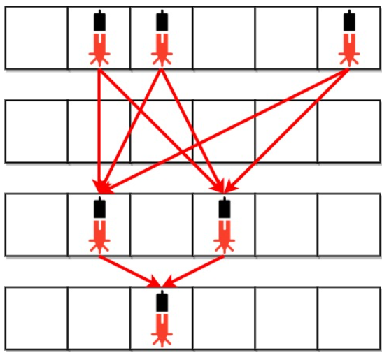

# Problem
Anti-theft security devices are activated inside a bank. You are given a 0-indexed binary string array bank representing the floor plan of the bank, which is an m x n 2D matrix. bank[i] represents the ith row, consisting of '0's and '1's. '0' means the cell is empty, while'1' means the cell has a security device.

There is one laser beam between any two security devices if both conditions are met:

1. The two devices are located on two different rows: r1 and r2, where r1 < r2.
2. For each row i where r1 < i < r2, there are no security devices in the ith row.

Laser beams are independent, i.e., one beam does not interfere nor join
with another.

Return the total number of laser beams in the bank.

---
**Example 1**
 

**Input:** bank = ["011001","000000","010100","001000"]     
**Output:** 8   
**Explanation:** Between each of the following device pairs, there is one beam. In total, there are 8 beams:
 * bank[0][1] -- bank[2][1]
 * bank[0][1] -- bank[2][3]
 * bank[0][2] -- bank[2][1]
 * bank[0][2] -- bank[2][3]
 * bank[0][5] -- bank[2][1]
 * bank[0][5] -- bank[2][3]
 * bank[2][1] -- bank[3][2]
 * bank[2][3] -- bank[3][2]
Note that there is no beam between any device on the 0th row with any on the 3rd row.
This is because the 2nd row contains security devices, which breaks the second condition.

# Approach
## Working with Example 1
```
r0: [0 d d 0 0 d]
r1: [0 0 0 0 0 0]
r2: [0 d 0 d 0 0]
r3: [0 0 d 0 0 0]
```
applying the rules for lazer beam:
1. r1 is not allowed to have any lazer device because r0 < r1 < r2.
2. number of beams:
  + b/w r0 and r1: (3 device) × (2 device) = 6
  + b/2 r2 and r3: (2 device) × (1 device) = 2
  + Conclude that 
  > (# beams b/w ri, ri+1) = (# devices in ri) × (# devices in ri+1)

# Solution
## Pattern
- A classic "Last-Seen Index/Event" 
  - Mini-Template
    ```
    prev = -1   # the index of previous event
    for i:
        if event:
            update answer using i - prev
            prev = i
    ```
- **Event**: existence of lazer device
- **Minimum state required**(in each iteration): `prev`, the previous number of devices


```python
def numberOfBeams(bank: List[str]) -> int:
    ans  = 0
    prev = 0
    for row in bank:
    	dev = row.count("1")
    	if dev > 0:
    		ans += prev * dev
    		prev = dev
    return ans
```

# Complexities
* let $n$ be the number of strings provided by the input, and $m$ be the length of each string.
## Time Complexity: $O(n * m)$
- Scanning each string to check device existence
$$
O(m)
$$
- Performing this operation across all strings
$$
O(mn)
$$

## Space Complexity: O(1)
- only use local variables
